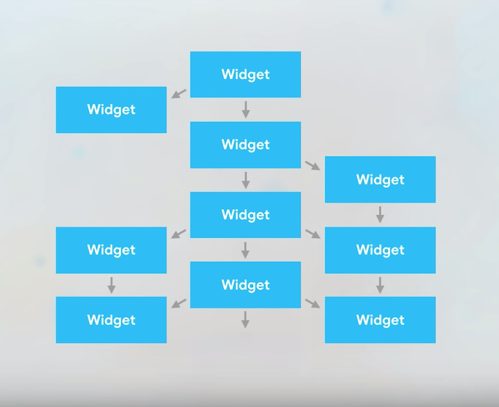
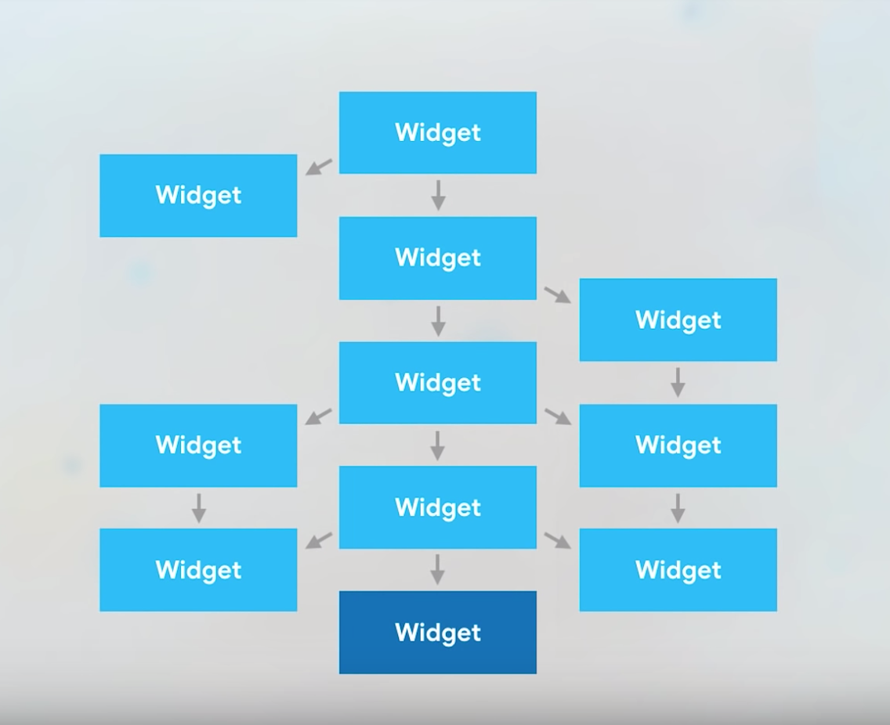
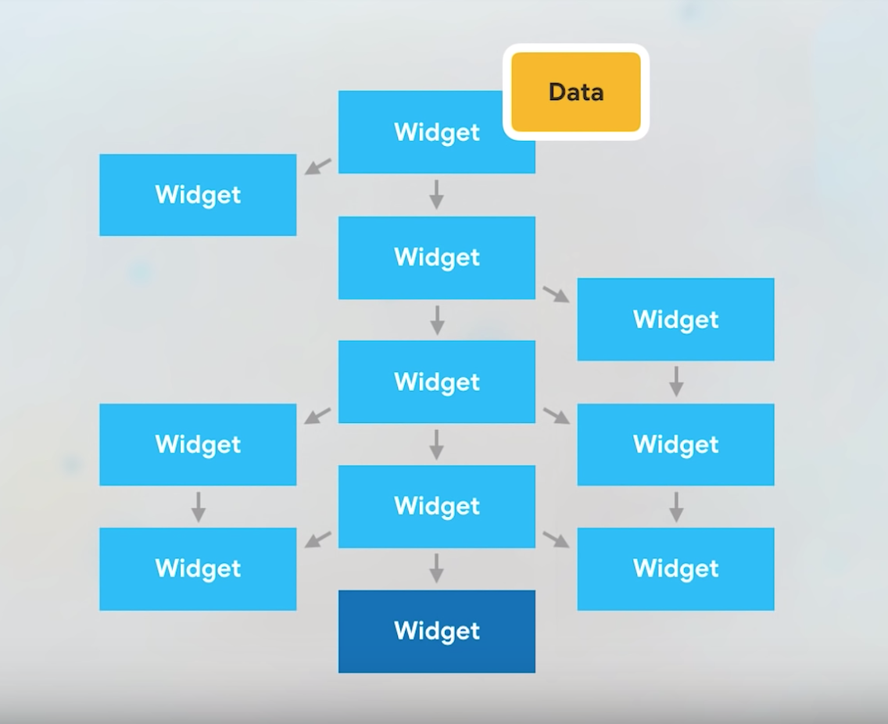
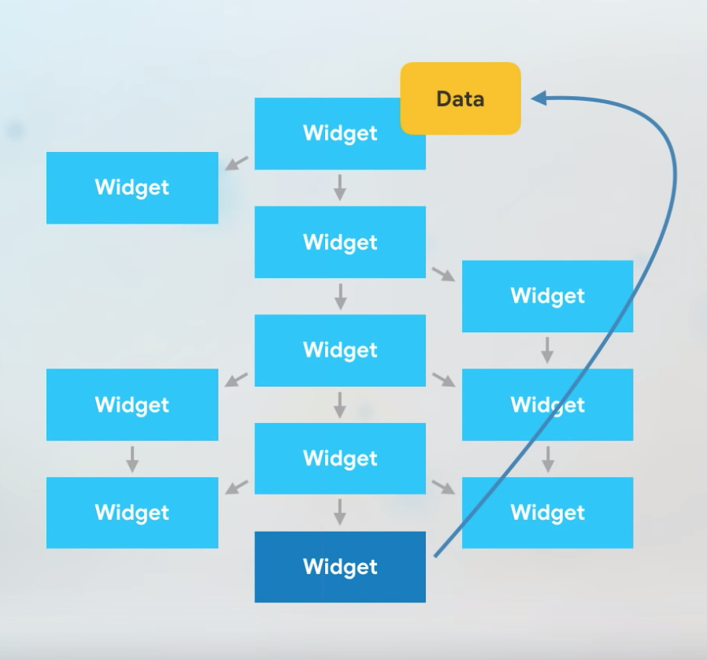
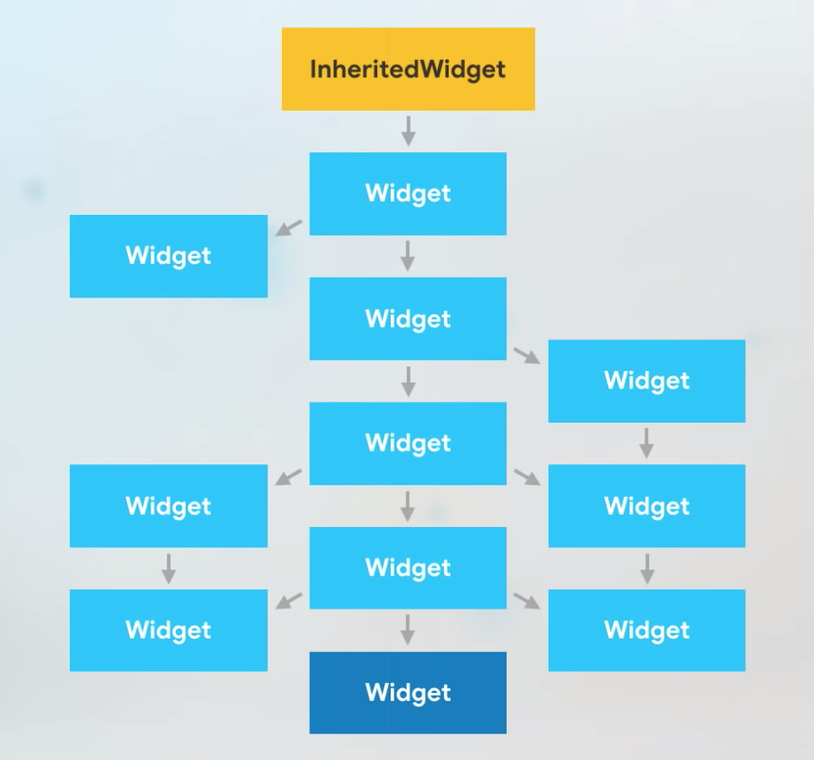
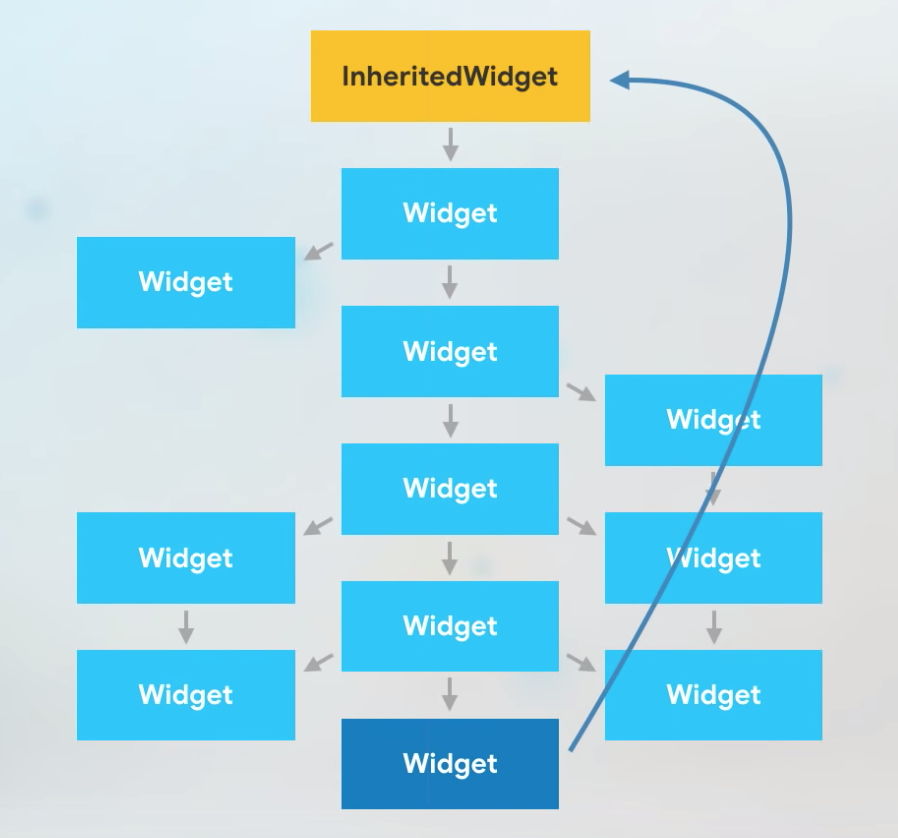
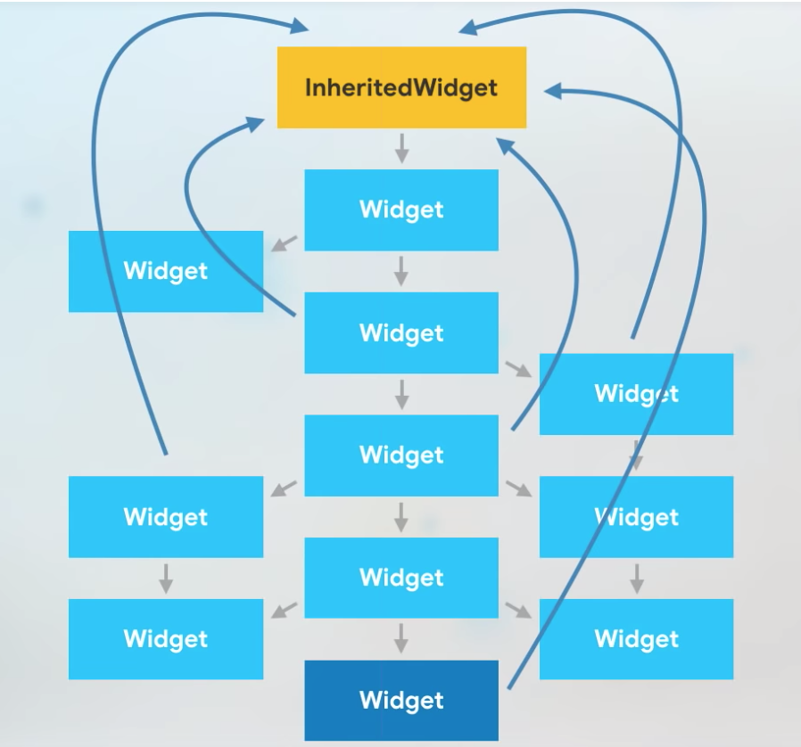

# Addierer zweier Zahlen / Adding two Numbers / Revised Version

## Erste Schritte

Diese Flutter App dient dem primären Ziel, den Einsatz des `InheritedWidget`-Steuerelements zu erläutern.
Funktionell ist die App identisch mit der *Adding two Numbers* App aus dem *Adder*-Repository
([https://github.com/peloflutter/addierer]).

Das Konzept kann neben der offiziellen Dokumentation auch in [Widget — State — BuildContext — InheritedWidget](https://medium.com/flutter-community/widget-state-buildcontext-inheritedwidget-898d671b7956) nachgelesen werden.

Um zu betrachten, wie ein Widget aus Basis mehrerer Teil-Widgets strukturiert werden kann, werfen wir am besten einen Blick auf den Quellcode der Klasse `HomePage`,
die für den Aufbau der zentralen App-Seite zuständig ist:

```
class HomePage extends StatelessWidget {
  @override
  Widget build(BuildContext context) {
    return Scaffold(
      appBar: AppBar(
        title: Text('Adding two Numbers - Extended'),
      ),
      body: SingleChildScrollView(
        child: Column(
          mainAxisAlignment: MainAxisAlignment.start,
          crossAxisAlignment: CrossAxisAlignment.stretch,
          children: <Widget>[
            NumberInputWidget(position: OperandPosition.firstOperand),
            NumberInputWidget(position: OperandPosition.secondOperand),
            ControllerAddWidget(),
            NumberOutputWidget(),
            ControllerClearWidget(),
            HorizontalLineWidget(),
          ],
        ),
      ),
    );
  }
}
```

Für die Eingabe eines Operanden zum Addieren gibt ein separates `NumberInputWidget`-Widget. Buttons wiederum sind in das `ControllerAddWidget`- oder `ControllerClearWidget`-Widget ausgelagert und Resultate 
werden in einem `NumberInputWidget`-Widget angezeigt.

Damit wird verständlich, dass die relevanten Daten zum Addieren zweier Zahlen in unterlagerten Widgets residieren und deshalb nicht direkt erreichbar sind. Es bietet sich nun an,
weiter oben in der Hierarchie aller Flutter-Steuerelemente ein `InheritedWidget`-Steuerelement zu positionieren:

```
class CalculatorInheritedWidget extends InheritedWidget {
  final CalculatorStateContainerState data;

  CalculatorInheritedWidget({
    Key key,
    @required Widget child,
    @required this.data,
  }) : super(key: key, child: child) {
    debugPrint("c'tor CalculatorInheritedWidget");
  }

  @override
  bool updateShouldNotify(CalculatorInheritedWidget oldWidget) {
    debugPrint("CalculatorInheritedWidget::updateShouldNotify");
    return true;
  }
}
```

Dieses `CalculatorInheritedWidget`-Steuerelement - also eine Spezialisierung der  `InheritedWidget`-Klasse - ist nun *soweit oben* im Hierarchiebaum aller Steuerelemente anzusiedeln,
wie die unterlagerten Steuerelemente auf die an dieser zentralen Stelle zur Verfügung gestellten Daten zugreifen wollen. In unserem Beispiel betrifft dies
die *state*-Klasse eines `StatefulWidget`-Objekts, hier: Klasse `CalculatorStateContainer`:


```
class CalculatorStateContainerState extends State<CalculatorStateContainer> {

  OperationModel model;   <== NOTE: data provided by this state object

  @override
  void initState() {
    debugPrint('CalculatorStateContainerState::initState');
    super.initState();

    model = OperationModel.zero();
  }

  @override
  Widget build(BuildContext context) {
    debugPrint('CalculatorStateContainerState::build');
    return CalculatorInheritedWidget(    <== NOTE: use of InheritedWidget object
      data: this,                        <== NOTE: 'this' means: THIS object is made public available
      child: widget.child,
    );
  }

  void add() {
    debugPrint('CalculatorStateContainerState::add');

    String firstOperand = model.firstOperand;
    String secondOperand = model.secondOperand;

    String result =
        (double.parse(firstOperand) + double.parse(secondOperand)).toString();

    setState(() {
      model.operation = Operation.add;
      model.result = result;
    });
  }
  ...
}
```

Die Klasse `CalculatorStateContainerState` besitzt eine Datenobjekt, hier: Objekt `model` vom Typ `OperationModel `. In der `build`-Methode der Klasse
wird das `CalculatorInheritedWidget`-Objekt eingeschleust, dem im Konstruktor im Parameter `data` via `this` die `CalculatorStateContainerState`-Instanz 
übergeben wird. Prinzipiell hätte man dem `data`-Parameter hier ein beliebiges Objekt übergeben können.

Das `CalculatorStateContainerState`-Objekt kann nun von tieferliegenden Widgets mit `inheritFromWidgetOfExactType` oder `ancestorWidgetOfExactType` angesprochen werden:

```
static CalculatorStateContainerState of(BuildContext context, bool rebuild) {
  CalculatorStateContainerState widget = (rebuild)
      ? (context.inheritFromWidgetOfExactType(CalculatorInheritedWidget)
              as CalculatorInheritedWidget)
          .data
      : (context.ancestorWidgetOfExactType(CalculatorInheritedWidget)
              as CalculatorInheritedWidget)
          .data;

  return widget;
}
```

Die bislang skizzierten Code-Snippets muss man in aller Ruhe studieren, ihre tieferliegende Funktionalität erschließt sich nicht mit einem schnellen Blick.
Nachfolgend finden Sie eine Abfolge mehrerer Abbildungen vor, die den bislang beschrieben Sachverhalt graphisch veranschaulichen:



Abbildung 1. Bestandsaufnahme eines hierarchischen Flutter Widgets Baums.



Abbildung 2. Ein weiteres Widget wird hinzugefügt.



Abbildung 3. Das hinzugefügte Widget möchte auf Daten weiter oben im Widgets Baum zugreifen.



Abbildung 4. Ein Widget-Objekt ist - prinzipiell - nicht ohne weiteres direkt ansprechbar.



Abbildung 5. Für den zentralen Datenzugriff ist eine `InheritedWidget`-Instanz im Widget Baum einzufügen.



Abbildung 6. Mit `inheritFromWidgetOfExactType` (oder einer Reihe sehr ähnlicher Methoden) ist die `InheritedWidget`-Instanz erreichbar.



Abbildung 7. Die Erreichbarkeit gilt für alle `Widget`-Instanzen unterhalb der eingefügten `InheritedWidget`-Instanz.

Im Quellcode finden sich zahlreiche Aufrufe der `debugPrint`-Funktion vor. Diese dienen vor allem dem Zweck, bei einem erneuten Laden der App den Aufbau des Widget-Baums studieren zu können,
welche Widgets neu gezeichnet werden (Aufruf der `build`-Methode) und welche nicht:

```
// Start der App:
flutter: c'tor CalculatorStateContainer
flutter: CalculatorStateContainerState::initState
flutter: CalculatorStateContainerState::build
flutter: c'tor CalculatorInheritedWidget
flutter: CalculatorApp::build
flutter: c'tor NumberInputWidget [OperandPosition.firstOperand]
flutter: c'tor NumberInputWidget [OperandPosition.secondOperand]
flutter: c'tor NumberOutputWidget
flutter: _NumberInputWidgetState::build
flutter: _NumberInputWidgetState::build
flutter: ControllerAddWidget::build
flutter: NumberOutputWidget::build
flutter: ControllerClearWidget::build
flutter: HorizontalLineWidget::build

// Erneuter Aufbau der App nach Eingabe der Operanden für eine Addition:
flutter: CalculatorStateContainerState::setInput => 1 [OperandPosition.firstOperand]
flutter: CalculatorStateContainerState::setInput => 2 [OperandPosition.secondOperand]
flutter: CalculatorStateContainerState::add
flutter: CalculatorStateContainerState::build
flutter: c'tor CalculatorInheritedWidget
flutter: CalculatorInheritedWidget::updateShouldNotify
flutter: NumberOutputWidget::build
flutter: _NumberInputWidgetState::build
flutter: _NumberInputWidgetState::build

// Erneuter Aufbau der App nach Klick auf den 'Clear'-Button:
flutter: CalculatorStateContainerState::clear
flutter: CalculatorStateContainerState::build
flutter: c'tor CalculatorInheritedWidget
flutter: CalculatorInheritedWidget::updateShouldNotify
flutter: NumberOutputWidget::build
flutter: _NumberInputWidgetState::build
flutter: _NumberInputWidgetState::build
```

Weitere Informationen zur Implementierung der App können Sie dem eingangs zitierten Literaturhinweis entnehmen.


Abbildung 1. Oberfläche der *Adding two Numbers - Extended*-App.

***

English-Version: TBD


xxxx


Launching lib/main.dart on iPhone 8 in debug mode...
Xcode build done.                                            9.9s
flutter: c'tor CalculatorStateContainer
flutter: CalculatorStateContainerState::initState
flutter: CalculatorStateContainerState::build
flutter: c'tor CalculatorInheritedWidget
flutter: CalculatorApp::build
flutter: c'tor NumberInputWidget [OperandPosition.firstOperand]
flutter: c'tor NumberInputWidget [OperandPosition.secondOperand]
flutter: c'tor NumberOutputWidget
flutter: _NumberInputWidgetState::build
flutter: _NumberInputWidgetState::build
flutter: ControllerAddWidget::build
flutter: NumberOutputWidget::build
flutter: ControllerClearWidget::build
flutter: HorizontalLineWidget::build

// Erneuter Aufbau der App nach Eingabe der Operanden für eine Addition:
flutter: CalculatorStateContainerState::setInput => 1 [OperandPosition.firstOperand]
flutter: CalculatorStateContainerState::setInput => 2 [OperandPosition.secondOperand]
flutter: CalculatorStateContainerState::add
flutter: CalculatorStateContainerState::build
flutter: c'tor CalculatorInheritedWidget
flutter: CalculatorInheritedWidget::updateShouldNotify
flutter: NumberOutputWidget::build
flutter: _NumberInputWidgetState::build
flutter: _NumberInputWidgetState::build

// Erneuter Aufbau der App nach Klick auf den 'Clear'-Button:
flutter: CalculatorStateContainerState::clear
flutter: CalculatorStateContainerState::build
flutter: c'tor CalculatorInheritedWidget
flutter: CalculatorInheritedWidget::updateShouldNotify
flutter: NumberOutputWidget::build
flutter: _NumberInputWidgetState::build
flutter: _NumberInputWidgetState::build
