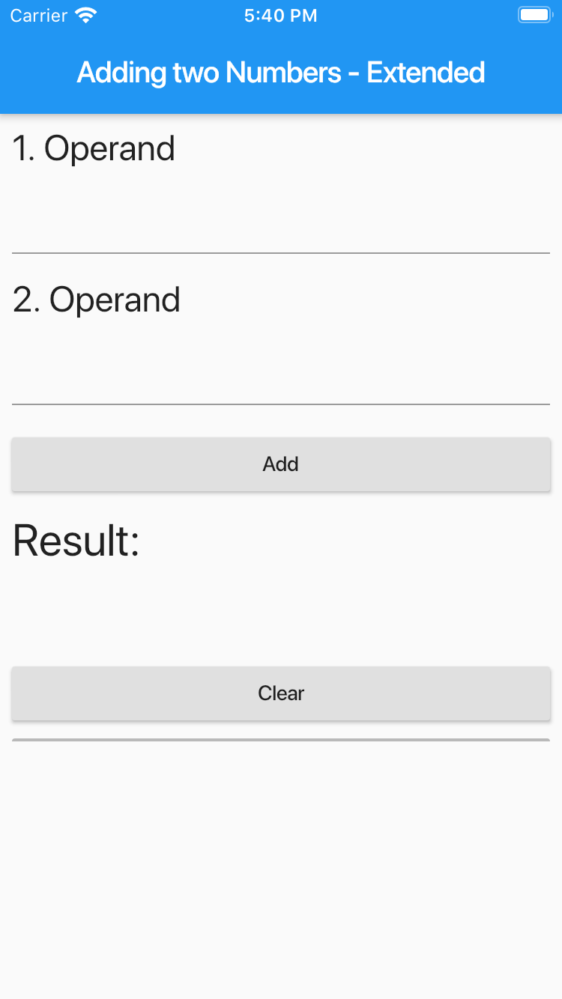

# Addierer zweier Zahlen / Adding two Numbers / Extended Version

## Erste Schritte

Diese App dient dem primären Ziel, den Einsatz des `InheritedWidget`-Steuerelements vorzustellen.
Funktionell ist die App identisch mit der *Adding two Numbers* App aus dem *Adder*-Repository
([https://github.com/peloflutter/addierer]).

Das Konzept kann neben der offiziellen Dokumentation auch in [Widget — State — BuildContext — InheritedWidget](https://medium.com/flutter-community/widget-state-buildcontext-inheritedwidget-898d671b7956) nachgelesen werden.

Um zu Betrachten, wie ein Widget in mehrere Teil-Widgets zerlegt werden kann, werfen wir am besten einen Blick auf den Quellcode der Klasse `HomePage`,
die für den Aufbau der zentralen App-Seite zuständig ist:

```
class HomePage extends StatelessWidget {
  @override
  Widget build(BuildContext context) {
    return Scaffold(
      appBar: AppBar(
        title: Text('Adding two Numbers - Extended'),
      ),
      body: CalculatorWidget(
        child: SingleChildScrollView(
          child: Column(
            mainAxisAlignment: MainAxisAlignment.start,
            crossAxisAlignment: CrossAxisAlignment.stretch,
            children: <Widget>[
              NumberInputWidget(position: OperandPosition.firstOperand),
              NumberInputWidget(position: OperandPosition.secondOperand),
              ControllerAddWidget(),
              NumberOutputWidget(),
              ControllerClearWidget(),
              HorizontalLineWidget(),
            ],
          ),
        ),
      ),
    );
  }
}
```

Für die Eingabe eines Operanden zum Addieren gibt ein separates `NumberInputWidget`-Widget. Buttons wiederum sind in das `ControllerAddWidget`- oder `ControllerClearWidget`-Widget ausgelagert und Resultate 
können in einem `NumberInputWidget`-Widget angesehen werden.

Damit wird verständlich, dass die relevanten Daten zum Addieren zweier Zahlen in unterlagerten Widgets residieren und damit nicht ganz trivial erreichbar sind. Es bietet sich nun an,
weiter oben in der Hierarchie aller Flutter-Steuerelemente ein `InheritedWidget`-Steuerelement zu positionieren:

```
class CalculatorInheritedWidget extends InheritedWidget {
  final CalculatorWidgetState data;

  CalculatorInheritedWidget({
    Key key,
    @required Widget child,
    @required this.data,
  }) : super(key: key, child: child) {
    debugPrint("c'tor CalculatorInheritedWidget");
  }

  @override
  bool updateShouldNotify(CalculatorInheritedWidget oldWidget) {
    debugPrint("CalculatorInheritedWidget::updateShouldNotify");
    return true;
  }
}
```

Das `CalculatorWidgetState`-Objekt in dieser Klasse kann nun von tieferliegenden Widgets mit `inheritFromWidgetOfExactType` oder `ancestorWidgetOfExactType` angesprochen werden:

```
static CalculatorWidgetState of(BuildContext context, bool rebuild) {
  CalculatorWidgetState widget = (rebuild)
      ? (context.inheritFromWidgetOfExactType(CalculatorInheritedWidget)
              as CalculatorInheritedWidget)
          .data
      : (context.ancestorWidgetOfExactType(CalculatorInheritedWidget)
              as CalculatorInheritedWidget)
          .data;

  return widget;
}
```

Im Quellcode finden sich zahlreiche Aufrufe der `debugPrint`-Funktion vor. Diese dienen vor allem dem Zweck, bei einem erneuten Aufbau des Widget-Baums studieren zu können,
welche Widgets nue gezeichnet werden (Aufruf der `build`-Methode) und welche nicht:

```
// Start der App:
flutter: MyApp::build
flutter: c'tor CalculatorWidget
flutter: CalculatorWidgetState::initState
flutter: CalculatorWidgetState::build
flutter: c'tor CalculatorInheritedWidget
flutter: c'tor NumberInputWidget [OperandPosition.firstOperand]
flutter: c'tor NumberInputWidget [OperandPosition.secondOperand]
flutter: c'tor NumberOutputWidget
flutter: c'tor CalculatorWidget
flutter: CalculatorWidgetState::initState
flutter: CalculatorWidgetState::build
flutter: c'tor CalculatorInheritedWidget
flutter: NumberInputWidgetState::build
flutter: NumberInputWidgetState::build
flutter: ControllerAddWidget::build
flutter: NumberOutputWidget::build
flutter: ControllerClearWidget::build
flutter: HorizontalLineWidget::build
// Erneuter Aufbau der App nach Eingabe der Operanden für eine Addition:
flutter: CalculatorWidgetState::setInput => 1 [OperandPosition.firstOperand]
flutter: CalculatorWidgetState::setInput => 11 [OperandPosition.firstOperand]
flutter: CalculatorWidgetState::setInput => 1 [OperandPosition.secondOperand]
flutter: CalculatorWidgetState::setInput => 12 [OperandPosition.secondOperand]
flutter: CalculatorWidgetState::add
flutter: CalculatorWidgetState::build
flutter: c'tor CalculatorInheritedWidget
flutter: CalculatorInheritedWidget::updateShouldNotify
flutter: NumberInputWidgetState::build
flutter: NumberOutputWidget::build
flutter: NumberInputWidgetState::build
// Ende.
```

Weitere Informationen zur Implementierung der App entnehmen Sie bitte der eingangs zitierten Literaturhinweis.



Abbildung 1. Oberfläche der *Adding two Numbers - Extended*-App.

***

English-Version: TBD
